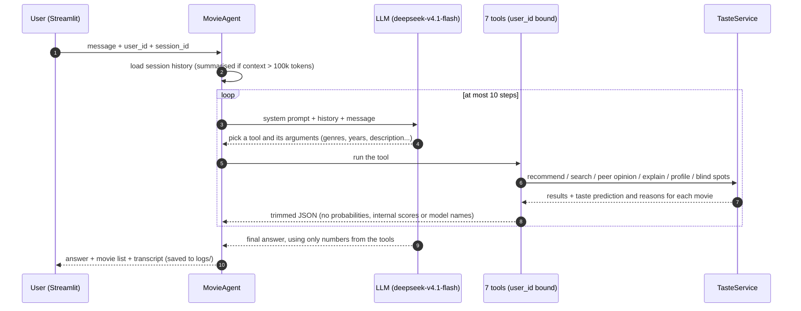
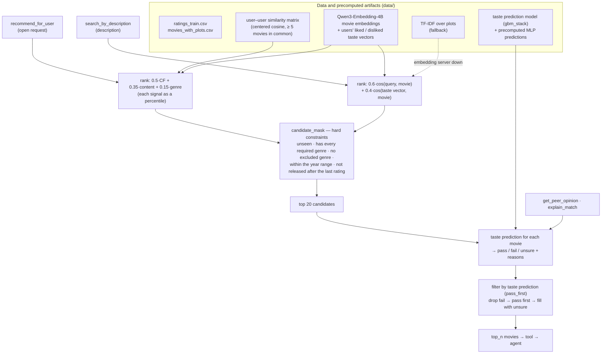

# Report: Trương Đăng Biển

*Experiment details live in the READMEs under `evaluation/`; sample conversations in
`evaluation/sample_conversations/`; how to run is at the end of the Open Section. A Vietnamese version is in `REPORT_vi.md`.*

## Problem Analysis

- **Users and needs.** A person who knows their MovieLens user ID and wants something to watch. They ask in natural language in many ways: open ("what should I watch tonight?"), descriptive ("a dark psychological thriller with a twist"), social ("what do people like me think of Pulp Fiction?") or reflective ("why would I like that?", "what's my blind spot?"), and follow up over several turns. They need an assistant that investigates the data on their behalf, not a search box.
- **A good conversational recommendation** must: meet every constraint the user states (genre, year, "no animation"…); fit *this* user's history; be short enough to read in a chat; and come with a reason the user can check — numbers from their own ratings and from people with similar taste, not the LLM's general movie knowledge.
- **Technical challenges.**
  - An LLM that knows a lot about movies readily fills gaps from memory; the answer must stay within what the tools returned, and the user must never see internals (probabilities, IDs, feature names).
  - Constraints must hold exactly even when the LLM forgets to pass a parameter; follow-ups ("what about the second one?") need the earlier turns.
  - The data is small and sparse: 610 users, 5,135 movies, 59k train ratings, ~51% of movies with fewer than 5 ratings. It is split in time per user (validation after train, test after validation), so every prediction is a prediction of a *future* rating.
  - Users rate on different scales: a harsh user's 3.0 is their average, a generous user's 3.0 is a dislike.

## Approach

### System

The problem is split into two layers: the **agent** (LLM) decides what to look up and phrases the answer; **TasteService** computes every number and picks every movie. The agent (`trusted_ai/agent.py`, `deepseek-v4.1-flash`) is bound to one user ID and has seven tools (`trusted_ai/tools/factory.py`). TasteService only reads `ratings_train.csv`, so held-out ratings never leak into profiles.

| Requirement | Tool | Data signals combined |
|---|---|---|
| 1. Personalise from rating history | `get_user_profile`, `recommend_for_user` | genre deviation vs the user's own mean (with confidence), similar users, content embeddings of liked/disliked movies; then filtered by taste prediction |
| 2. Multi-step questions | `get_similar_users`, `get_peer_opinion`, `search_by_description` | centered-cosine neighbours (≥ 5 co-rated movies) → their ratings of the asked movie; query embedding + the user's taste vector, with genre/year constraints |
| 3. Explain with historical data | `explain_match`, `get_blind_spots` | taste prediction with plain-language reasons, the most similar movies the user rated highly, genre deviations; genres the catalog offers but the user never rates |

Two components support the conversation: long conversations are compacted (`trusted_ai/history.py`) — past 100k context tokens, the middle turns are folded into a summary that keeps every movie discussed with its numbers, rather than being cut, so follow-ups still work; and every conversation is saved as a transcript (`trusted_ai/transcripts.py`) with each tool call and the exact output the LLM saw — the same format the evaluations read. The Streamlit app (`app/streamlit_app.py`) is a thin chat UI over the agent.

#### Agent flow



The LLM only decides *what to look up* and *how to say it*; every number and every movie comes from TasteService. The
system prompt forbids adding movie facts beyond the tool results and mentioning models, probabilities or IDs.

#### TasteService architecture

`TasteService` (`trusted_ai/taste/service.py`) loads the data and the precomputed artifacts once at start-up, then
answers every taste question.



- **Open recommendations** (`recommend.py`): blend three signals. *CF* is the rating predicted from the 20 most similar users. *Content* is the similarity between the movie and the user's taste vector (a mean of the embeddings of movies they rated ≥ 4, weighted by how far each beats their own average). *Genre* is the user's rating deviation on the movie's genres relative to their own mean. Each signal is turned into a percentile before blending so the three scales are comparable.
- **Search by description** (`search.py`): only the user's query is embedded at runtime (cached). Score = 60% match with the description + 40% fit with the user's taste. Embeddings understand free-text descriptions better than keyword matching; if the embedding server is unreachable, search falls back to TF-IDF so the app keeps working.
- **Filtering** (`filters.py`): hard constraints are applied *before* candidates are chosen, so they hold even when the LLM forgets. The "not released after the last rating" cap reflects the offline data: a user's "now" is their latest rating.
- **Taste prediction** (`scoring.py`, `learned/`): predicts the user's taste for one movie — **pass** (predicted rating ≥ 4), **fail** (≤ 2.5) or **unsure**. Two GBMs (probability of liking / disliking) over 13 features computed from train: what similar users think, how generous the user is, how well the movie is rated overall, genre deviation, content similarity, how the user rated similar movies (item-CF), and the rating an MLP predicts from the movie's embedding (precomputed, so no torch at runtime). Thresholds are chosen for pass precision ≥ 80% and fail precision ≥ 70%. Reasons for the user come from switching each signal group off and keeping the groups that change the outcome, e.g. "the movies most like this one you rated 0.8★ above your average". gbm_stack was chosen because it matches the precision of the best single GBM while answering more pairs; the other options are compared in `evaluation/score_candidate/README.md`.
- **Taste check**: all 20 candidates go through taste prediction; fails are dropped, passes go first, and unsure movies only fill the remaining slots (`verified: false`).

### Decision Log

| Decision | Alternative considered | Why I chose this |
|----------|----------------------|-----------------|
| **Tools + agent**: the LLM only picks tools and phrases the answer; every number is computed in code | A fixed pipeline per intent (classify → retrieve → template answer) | The sample questions mix intents and follow-ups ("why that one?", "the second one"), which a fixed pipeline struggles to cover. Tools keep the numbers right, and the transcript records exactly what the LLM saw — which is what makes groundedness checkable. |
| Enforce constraints **in the tools** (every listed genre, year range, nothing released after the user's last rating) | Trust the LLM to pass the right arguments and filter | Attributing all 95 constraint violations showed 85 came from tool behaviour (no year parameters, "any genre" matching, no time cap), not from the LLM. After the fix, movies meeting every constraint rose from 74.3% to 95.9%. |
| Use taste prediction as **pass first, never fail** | Return passes only; or only label movies without filtering | Replaying the same tool calls, pass-first kept constraint and fit scores unchanged (±1.3 points) while every movie is taste-checked; pass-only left 20 of 60 conversations with nothing to recommend. |

## Evaluation

### How I evaluate

The task asks for evidence of recommendation quality. A single number is not enough, because an answer can fail in three different ways: wrong for the request, wrong for the user's taste, or a made-up explanation. I evaluate each layer with a method suited to it:

| Question | Method | Why this method |
|---|---|---|
| Do the recommended movies meet the request and fit its context? | Run the real agent on 60 test conversations; check hard constraints exactly in code, and have an LLM judge rate each movie's fit | Measures what the user actually receives, through the whole agent + tool flow. Constraints can be checked exactly; "like Alien but not horror" can only be judged by an LLM. |
| Are the explanations grounded? | Split answers into claims and check each against the evidence in the transcript; a regex catches leaked internals | Requirement 3: explanations must come from the data, not LLM knowledge. Claim-level scoring shows *which kind* of information gets made up. |
| Is the taste prediction right? | Taste prediction on 7,664 held-out ratings (test split, in time), measuring precision / coverage | In the 60 conversations only 5 of 315 recommended movies have a real rating in the test split — too few; evaluating this component on its own has enough real labels. |
| Does it behave as designed? | Real sample conversations + 52 unit tests | Shows concrete behaviour that aggregate numbers hide. |

### 1. The agent on 60 test conversations

`evaluation/recommendation/data/recommend_test.json`: 60 conversations with hard constraints (genres, years, exclusions) and contextual requests ("like Alien but not horror", "a light date-night movie"). LLM judge decisions are cached by prompt version, judge model, case and movie so results are reproducible.

| agent / tools | conversations with no movie | movies meeting all constraints | movies judged a good fit | conversations with ≥ 1 good fit |
|---|---|---|---|---|
| gpt-4.1-mini, original tools (judge gpt-4.1-mini) | 4 | 66.1% | 59.9% | 71.0% |
| deepseek-v4.1-flash, original tools (judge deepseek) | 0 | 74.3% | 72.1% | 90.9% |
| **deepseek-v4.1-flash, fixed tools, current agent (judge deepseek)** | 1 | **95.9%** | **78.4%** | **100.0%** |

- 58 of 60 conversations get at least one movie that both meets every constraint and fits the request, 54 get at least three and 41 get five.
- Most of the improvement came from fixing the tools (constraints 74.3% → 95.9%), not from changing the LLM.
- No answer quoted a probability or threshold; 1 of 59 still mentioned "the model" in passing.

### 2. Groundedness of the explanations

On three Streamlit chat logs (users 1, 10, 30; 24 judged answers, 365 claims; `evaluation/explanation_groundedness/results/groundedness_logs.md`):

| claim type | claims | supported | contradicted | unsupported | external (LLM knowledge) |
|---|---|---|---|---|---|
| numbers about peers / predictions / the user | 93 | 91.4% | 3.2% | 5.4% | 0.0% |
| genre preferences | 47 | 91.5% | 4.3% | 4.3% | 0.0% |
| movie references | 56 | 94.6% | 0.0% | 1.8% | 3.6% |
| qualitative (tone, story) | 169 | 68.0% | 0.6% | 5.3% | 26.0% |
| **overall** | **365** | **81.1%** | **1.6%** | **4.7%** | **12.6%** |

The numbers hold up: 91.7% of answers cite at least one data number, and no answer leaked a probability, ID, model or field name. What slips is description — tone words and story details the data does not state. Only 16.7% of answers are grounded in *every* claim, so the honest conclusion is "the numbers are trustworthy, the adjectives are not always". The sample is small (3 conversations), and the judge is itself an LLM, so it misses some.

### 3. Taste prediction

On the full test split (7,664 pairs, 610 users, ratings the model never saw):

| method | coverage | pass precision | fail precision | overall precision |
|---|---|---|---|---|
| hand-written rule cascade (original) | 35.4% | 76.9% | 53.8% | 69.6% |
| **gbm_stack (current)** | **29.8%** | **80.7%** | **85.8%** | **81.7%** |

Probabilities are well calibrated (every 0.1 bin within 0.04 of the observed rate) and serious errors are rare: only 3.6% of passes are movies the user rated ≤ 2.5. Weaknesses: it answers only 30% of pairs, and harsh users rarely get a pass (71 of the 88 harshest users get none). The running code reproduces the experiment exactly (1,823 pass / 459 fail).

### 4. Sample conversations and tests

`evaluation/sample_conversations/`, answers shortened:

- *User 15, "What do people with similar taste to mine think about Pulp Fiction?"* → one `get_peer_opinion` call: "14 of them have rated it, and they land at 4.29★ on average … you gave it 4.0 yourself." The tool checked the 20 nearest neighbours, 14 had rated it, weighted average 4.29 — every number traces back to the tool output.
- *User 15, "I want a dark psychological thriller with a twist"* → *The Usual Suspects*, *Silence of the Lambs*, *Shutter Island*, with a caveat that thriller and mystery run below this user's average and they did not like *Memento*.
- *User 1, "Why do you think I'd like that?"* (about *Chitty Chitty Bang Bang*) → musicals and children's movies are rated well above their own average; the closest movies they loved are *Willy Wonka*, *Alice in Wonderland* and *Bedknobs and Broomsticks* (all 5★); one close-taste viewer gave it 2.5★.
- *User 10, "I liked Toy Story but I'm tired of animated movies — what else?"* → *Little Miss Sunshine*, *Into the Wild*, *O Brother, Where Art Thou?* — none animated, each with the similar users' rating.
- *User 1, "What's my blind spot?"* → Documentary and IMAX (never rated), noting IMAX is a format rather than a gap in taste.

52 unit tests pass in the Docker image (taste prediction and reasons, pass/fail filtering, genre and year filters,
history compaction, transcripts, ranking metrics, groundedness checks).

### Failure Analysis

**1. An impossible request, answered with a wrong list anyway.**
- *What the user asked* (user 40, eval): "Recommend an unseen Horror movie released in 2010 or later."
- *What the system recommended*: the agent called tools eight times, gradually relaxing the request (dropping the genre, then the year), said "there's nothing in the catalog from 2010 onward" and then suggested *The Shining*; the list shown held ten horror movies from the 1980s–90s (*Halloween*, *Poltergeist*, *Scream*…) — all ten break the year constraint.
- *Why it failed*: user 40's last rating is from 1996, and the tools do not recommend movies released after that point, so indeed no movie qualifies. But the tool only returned an empty list without saying *why*, so the agent guessed the wrong cause ("the catalog has none") and relaxed the constraints itself; the list shown is the result of the last tool call, not what the agent said.
- *What would fix it*: tools return a reason when the result is empty (e.g. "min_year is after this user's last rating"); the prompt forbids silently relaxing constraints; show only the movies the agent actually recommends.

**2. The agent forgot to pass the genre constraint.**
- *What the user asked* (user 133, eval): "I love mysteries where you can't trust the narrator and everything flips at the end — recommend one I haven't seen."
- *What the system recommended*: *And Then There Were None*, *Strangers on a Train*, *Suture*, *One Flew Over the Cuckoo's Nest*, *Murder by Death* — 3 of the 5 are not Mystery movies.
- *Why it failed*: the agent called `search_by_description` with a good description but without `include_genres=["Mystery"]`; embedding search returned movies whose plots are close to the description (psychological, deception, twist) but that are not in the Mystery genre. Constraints in the tools only protect the request when the LLM passes them.
- *What would fix it*: turn a genre named explicitly in the question ("mysteries") into a constraint before calling the tool, or have the tool warn when the description names a genre while `include_genres` is empty.

## Reflection

- **What works well:** multi-step questions ("people like me" → neighbours → their ratings) are answered with numbers that trace back to tool output (91% of numeric claims supported, no leaked internals); recommended movies meet the constraints (95.9%), every conversation with a contextual request gets at least one good fit, and every movie is taste-checked; every conversation is a transcript that can be re-judged; the app keeps working without the embedding server or the model.
- **What doesn't work well, and why:** descriptions still leak LLM knowledge (26% of qualitative claims are `external`) because groundedness is asked for in the prompt but not enforced; the agent relaxes constraints instead of saying "there is none" because the tools do not explain an empty result; taste prediction answers only about 30% of pairs and mostly learns "is this user a generous rater", so harsh users rarely get a pass while generous users sometimes get an overconfident one. The assistant forgets everything between sessions: it can recommend yesterday's movie again, and a rating the user mentions in chat is lost.
- **With more time:** an online claim check at answer time (Failure 2); tools that explain empty results (Failure 1); evaluating the list the agent actually presents; per-user top-k for taste prediction; extending the groundedness evaluation beyond 3 conversations. And a **background conversation tracker**, separate from the chat path so it adds no latency, that reads the saved transcripts and keeps, per user: the movies already recommended and the user's reaction (to avoid repeats); a short cross-session taste summary passed to the agent at the start of a session; and ratings the user states in chat, stored in a separate feedback table. Those ratings would not go straight into `ratings_train.csv` — profiles, similarity and the model are precomputed from it, and the temporal train/test split would break — but would be merged periodically by an offline step that rebuilds the artifacts.

## Open Section

**Difficulties along the way.**

- **Where the constraint failures really came from.** It looked like the LLM was passing wrong arguments; attributing every violation showed 85 of 95 came from the tools. The LLM was responsible for the rest and for the empty answers (the same genre both included and excluded, genre names such as "Science Fiction" that are not in the catalog) — which deepseek no longer did.
- **Agent noise hides small effects.** Two agent runs choose different tools and arguments, so comparing filtering options across runs mixed their effect with LLM randomness (+5.6 points that were not real). Replaying the same recorded tool calls under each option isolated the effect.
- **Explanations that leaked the model.** The first integration put `P(liked) = 0.846` and `source: learned_model` into the evidence sent to the LLM. Reasons now contain only the signals the prediction depends on, and internals are stripped by the tools.
- **Taste prediction — main lessons** (details: `evaluation/score_candidate/experiment_note.md`): compare models at the same recall, because the MLP's "higher coverage" turned out to be only a looser threshold; labels relative to the user's mean look fairer but are much harder to learn; a leakage bug of my own when adding item-CF to the MLP was caught before shipping.
- **Packaging.** The Docker image pins scikit-learn 1.8 (the version the model was pickled with). `docker run --env-file` keeps trailing spaces and quotes that `python-dotenv` strips, so a `.env` that works locally can cause a 404 from the LLM endpoint inside the container.

**How to run.** External services: an OpenAI-compatible LLM endpoint (`OPENAI_API_KEY`, `OPENAI_BASE_URL`; default model `deepseek/deepseek-v4.1-flash`, used by the agent and the judges) and, optionally, an embedding endpoint serving Qwen3-Embedding-4B (`EMBEDDING_BASE_URL`, `EMBEDDING_API_KEY`, `EMBEDDING_MODEL`; e.g. OpenRouter with `qwen/qwen3-embedding-4b`, which matches the precomputed movie vectors — cosine 0.9999). Without the embedding endpoint, description search falls back to TF-IDF. All other artifacts are precomputed in `data/` and baked into the image.

```bash
cp .env.example .env        # fill in the keys; no quotes and no trailing spaces
docker build -t trusted-ai .
docker run --rm -p 8501:8501 --env-file .env trusted-ai     # open http://localhost:8501
```

Without Docker: `pip install -r requirements.txt` and `streamlit run app/streamlit_app.py`. Recorded outputs that need no API key: `evaluation/sample_conversations/`, `evaluation/recommendation/results/`, `evaluation/explanation_groundedness/results/`, `evaluation/score_candidate/`.
