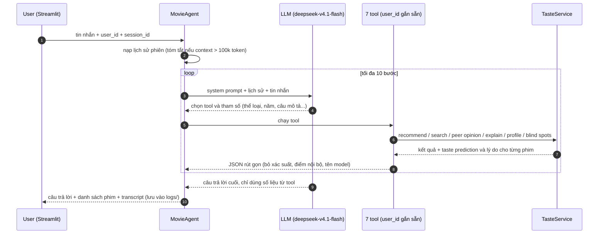
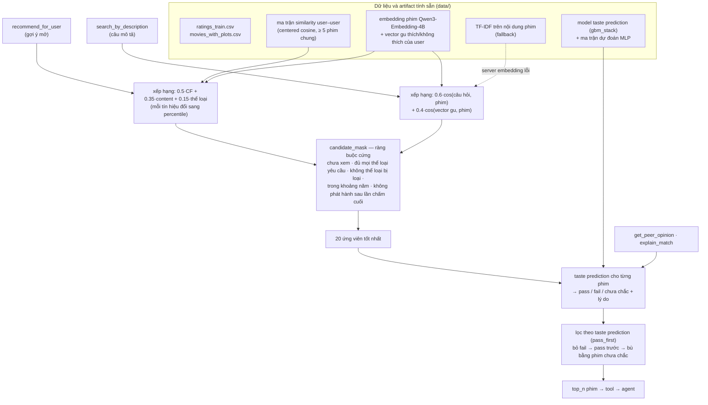

# Report: Trương Đăng Biển

*Bản tiếng Việt. Chi tiết thí nghiệm nằm trong các README dưới `evaluation/`; hội thoại mẫu trong
`evaluation/sample_conversations/`; cách chạy ở cuối Open Section.*

## Problem Analysis

- **Người dùng và nhu cầu.** Một người biết MovieLens user ID của mình và muốn tìm phim để xem. Họ hỏi bằng ngôn ngữ tự nhiên theo nhiều kiểu: mở ("tối nay xem gì?"), mô tả ("phim tâm lý đen tối có twist"), xã hội ("người giống tôi nghĩ gì về Pulp Fiction?") hoặc tự xét ("sao bạn nghĩ tôi sẽ thích?", "tôi đang bỏ sót thể loại nào?"), và hỏi tiếp qua nhiều lượt. Họ cần một trợ lý tự tra cứu dữ liệu thay họ, không phải một ô tìm kiếm.
- **Gợi ý tốt trong hội thoại** phải: thỏa mọi ràng buộc user nêu (thể loại, năm, "không hoạt hình"…); hợp với lịch sử của *chính* user này; đủ ngắn để đọc trong chat; và kèm lý do user kiểm chứng được — con số từ rating của họ và của người giống gu, không phải kiến thức phim chung của LLM. 
- **Thách thức kỹ thuật.**
  - LLM biết nhiều về phim nên dễ lấp chỗ trống bằng trí nhớ; câu trả lời phải nằm trong những gì tool trả về, và user không được thấy chi tiết nội bộ (xác suất, ID, tên đặc trưng).
  - Ràng buộc phải đúng tuyệt đối dù LLM có quên truyền tham số; câu hỏi nối tiếp ("phim thứ hai thì sao?") cần nhớ các lượt trước.
  - Dữ liệu nhỏ và thưa: 610 user, 5,135 phim, 59k rating train, ~51% phim có dưới 5 rating. Dữ liệu chia theo thời gian cho từng user (validation sau train, test sau validation), nên mọi dự đoán là dự đoán rating *tương lai*.
  - Mỗi user chấm theo thang khác nhau: 3.0 của người khó tính là mức trung bình, của người dễ tính là không thích.

## Approach

### Hệ thống

Bài toán được tách làm hai tầng: **agent** (LLM) quyết định cần tra cứu gì và diễn đạt câu trả lời; **TasteService** tính mọi con số và chọn mọi phim. Agent (`trusted_ai/agent.py`, `deepseek-v4.1-flash`) được gắn với một user ID — và có bảy tool (`trusted_ai/tools/factory.py`). TasteService chỉ đọc `ratings_train.csv`, nên rating giữ lại để đánh giá không bao giờ lọt vào profile.

| Yêu cầu của đề | Tool | Các tín hiệu dữ liệu được kết hợp |
|---|---|---|
| 1. Cá nhân hóa từ lịch sử rating | `get_user_profile`, `recommend_for_user` | độ lệch thể loại so với trung bình của chính user (kèm độ tin cậy), user tương tự, embedding nội dung của phim thích/không thích; rồi lọc bằng taste prediction |
| 2. Câu hỏi nhiều bước | `get_similar_users`, `get_peer_opinion`, `search_by_description` | láng giềng theo centered cosine (≥ 5 phim cùng chấm) → rating của họ cho phim được hỏi; embedding câu hỏi + vector gu của user, kèm ràng buộc thể loại/năm |
| 3. Giải thích bằng dữ liệu lịch sử | `explain_match`, `get_blind_spots` | taste prediction kèm lý do bằng ngôn ngữ thường, các phim giống nhất mà user từng chấm cao, độ lệch thể loại; các thể loại catalog có nhưng user không bao giờ chấm |

Hai thành phần hỗ trợ hội thoại: hội thoại dài được nén (`trusted_ai/history.py`) — khi context vượt 100k token, các lượt ở giữa được gộp thành một bản tóm tắt giữ lại mọi phim đã bàn kèm con số, thay vì cắt bỏ, để câu hỏi nối tiếp vẫn trả lời được; và mọi hội thoại được lưu thành transcript (`trusted_ai/transcripts.py`) với từng lời gọi tool và đúng output LLM đã thấy — cùng định dạng các bộ đánh giá đọc. App Streamlit (`app/streamlit_app.py`) là giao diện chat mỏng bọc quanh agent.

#### Luồng chung của agent



LLM chỉ quyết định *tra cứu gì* và *diễn đạt thế nào*; mọi con số và mọi phim đều do TasteService tính. System prompt cấm thêm thông tin về phim ngoài kết quả tool và cấm nhắc tới model, xác suất hay ID.

#### Kiến trúc TasteService

`TasteService` (`trusted_ai/taste/service.py`) nạp dữ liệu và các artifact tính sẵn một lần khi khởi động, rồi trả lời mọi câu hỏi về gu.



- **Gợi ý mở** (`recommend.py`): trộn ba tín hiệu. *CF* là rating dự đoán từ 20 user giống gu nhất. *Content* là độ giống giữa phim và vector gu của user (trung bình embedding các phim họ chấm ≥ 4, phim nào vượt trung bình của họ càng nhiều thì trọng số càng lớn). *Thể loại* là độ lệch rating của user trên các thể loại của phim so với trung bình của chính họ. Mỗi tín hiệu đổi sang percentile trước khi trộn để ba thang đo so sánh được.
- **Tìm theo mô tả** (`search.py`): chỉ câu hỏi của user được embed lúc chạy (có cache). Điểm = 60% độ khớp với câu mô tả + 40% độ hợp với gu. Embedding hiểu câu mô tả tự do tốt hơn khớp từ khóa; không gọi được server embedding thì tự chuyển sang TF-IDF để app vẫn chạy.
- **Lọc** (`filters.py`): ràng buộc cứng được áp *trước khi* chọn ứng viên, nên luôn đúng dù LLM có quên. Giới hạn "không phát hành sau lần chấm cuối" phản ánh dữ liệu offline: "hiện tại" của một user là lần chấm cuối của họ.
- **Taste prediction** (`scoring.py`, `learned/`): dự đoán khẩu vị của user với một phim — **pass** (đoán rating ≥ 4), **fail** (≤ 2.5) hoặc **chưa chắc**. Hai GBM (xác suất thích / không thích) trên 13 đặc trưng tính từ train: ý kiến của người giống gu, mức chấm dễ/khó của user, độ nổi tiếng của phim, độ lệch thể loại, độ giống nội dung, cách user chấm các phim tương tự (item-CF), và rating do một MLP dự đoán từ embedding phim (tính sẵn, không cần torch lúc chạy). Ngưỡng chọn sao cho precision pass ≥ 80%, fail ≥ 70%. Lý do cho user được tạo bằng cách tắt từng nhóm tín hiệu và giữ nhóm nào làm kết quả đổi, ví dụ "những phim giống phim này bạn chấm cao hơn trung bình của bạn 0.8★". Chọn gbm_stack vì nó giữ precision ngang GBM tốt nhất mà trả lời được nhiều cặp hơn; so sánh các phương án khác trong `evaluation/score_candidate/README.md`.
- **Xác nhận gu**: 20 ứng viên đều qua taste prediction; phim fail bị bỏ, phim pass lên trước, phim chưa chắc chỉ dùng để lấp chỗ trống (`verified: false`).

### Decision Log

| Decision | Alternative considered | Why I chose this |
|----------|----------------------|-----------------|
| **Tool + agent**: LLM chỉ chọn tool và diễn đạt, mọi con số tính trong code | Một pipeline cố định cho mỗi ý định (phân loại → truy xuất → trả lời theo mẫu) | Các câu hỏi mẫu trộn nhiều ý định và câu hỏi nối tiếp ("sao lại phim đó?", "phim thứ hai"), pipeline cố định khó phủ hết. Tool giữ con số đúng, và transcript ghi lại đúng những gì LLM đã thấy — nhờ vậy mới kiểm tra được groundedness. |
| Áp ràng buộc **trong tool** (đủ mọi thể loại đã nêu, khoảng năm, không phim nào phát hành sau rating cuối của user) | Tin LLM truyền đúng tham số và tự lọc | Phân tích 95 lỗi vi phạm ràng buộc cho thấy 85 lỗi đến từ hành vi của tool (không có tham số năm, khớp "bất kỳ thể loại nào", không giới hạn thời gian), không phải từ LLM. Sau khi sửa, phim thỏa mọi ràng buộc tăng từ 74.3% lên 95.9%. |
| Dùng taste prediction theo kiểu **pass trước, không bao giờ fail** | Chỉ trả về phim pass; hoặc chỉ gắn nhãn mà không lọc | Phát lại cùng các lời gọi tool: pass-first giữ nguyên điểm ràng buộc và độ hợp ngữ cảnh (±1.3 điểm) trong khi mọi phim đều được kiểm tra gu; pass-only khiến 20 trên 60 hội thoại không có gì để gợi ý. |

## Evaluation

### Cách đánh giá

Đề yêu cầu bằng chứng cho chất lượng gợi ý. Một con số duy nhất không đủ, vì một câu trả lời có thể sai theo ba cách khác nhau: sai yêu cầu, sai gu, hoặc giải thích bịa. Tôi đánh giá từng lớp bằng phương pháp phù hợp với nó:

| Câu hỏi | Phương pháp | Vì sao chọn |
|---|---|---|
| Phim gợi ý có đúng yêu cầu và hợp ngữ cảnh không? | Chạy agent thật trên 60 hội thoại test; kiểm tra ràng buộc cứng chính xác bằng code, độ hợp ngữ cảnh do LLM judge chấm từng phim | Đo đúng thứ user nhận được, cả luồng agent + tool. Ràng buộc kiểm được tuyệt đối; "giống Alien nhưng không kinh dị" thì chỉ LLM mới chấm được. |
| Lời giải thích có căn cứ không? | Tách câu trả lời thành claim, chấm từng claim với bằng chứng trong transcript; regex bắt rò rỉ chi tiết nội bộ | Yêu cầu 3 của đề: phải dựa trên dữ liệu, không phải kiến thức LLM. Chấm theo claim cho biết *loại* thông tin nào hay bị bịa. |
| Dự đoán gu có đúng không? | Taste prediction trên 7,664 rating giữ lại (tập test, theo thời gian), đo precision / coverage | Trong 60 hội thoại, chỉ 5 trên 315 phim gợi ý có rating thật trong tập test — quá ít; đánh giá riêng thành phần này thì có đủ nhãn thật. |
| Có chạy đúng như thiết kế không? | Ví dụ hội thoại thật + 52 unit test | Cho thấy hành vi cụ thể mà số liệu tổng hợp che mất. |

### 1. Agent trên 60 hội thoại test

`evaluation/recommendation/data/recommend_test.json`: 60 hội thoại có ràng buộc cứng (thể loại, năm, loại trừ) và yêu cầu ngữ cảnh ("giống Alien nhưng không kinh dị", "hẹn hò nhẹ nhàng"). LLM judge được cache theo phiên bản prompt, model judge, case và phim để kết quả tái lập được.

| agent / tool | hội thoại không có phim nào | phim thỏa mọi ràng buộc | phim hợp ngữ cảnh | hội thoại có ≥ 1 phim hợp ngữ cảnh |
|---|---|---|---|---|
| gpt-4.1-mini, tool ban đầu (judge gpt-4.1-mini) | 4 | 66.1% | 59.9% | 71.0% |
| deepseek-v4.1-flash, tool ban đầu (judge deepseek) | 0 | 74.3% | 72.1% | 90.9% |
| **deepseek-v4.1-flash, tool đã sửa, agent hiện tại (judge deepseek)** | 1 | **95.9%** | **78.4%** | **100.0%** |

- 58 trên 60 hội thoại có ít nhất một phim vừa thỏa mọi ràng buộc vừa hợp ngữ cảnh, 54 có ít nhất ba phim và 41 có năm phim.
- Phần lớn cải thiện đến từ việc sửa tool (ràng buộc 74.3% → 95.9%), không phải từ đổi LLM.
- Không câu trả lời nào trích xác suất hay ngưỡng; 1 trên 59 vẫn nhắc thoáng qua "the model".

### 2. Groundedness của lời giải thích

Trên ba log chat Streamlit (user 1, 10, 30; 24 câu trả lời được chấm, 365 claim;
`evaluation/explanation_groundedness/results/groundedness_logs.md`):

| loại claim | số claim | có căn cứ | mâu thuẫn | không có căn cứ | bên ngoài (kiến thức LLM) |
|---|---|---|---|---|---|
| con số về peer / dự đoán / user | 93 | 91.4% | 3.2% | 5.4% | 0.0% |
| sở thích thể loại | 47 | 91.5% | 4.3% | 4.3% | 0.0% |
| nhắc tới phim | 56 | 94.6% | 0.0% | 1.8% | 3.6% |
| định tính (giọng điệu, cốt truyện) | 169 | 68.0% | 0.6% | 5.3% | 26.0% |
| **tổng** | **365** | **81.1%** | **1.6%** | **4.7%** | **12.6%** |

Các con số đứng vững: 91.7% câu trả lời trích ít nhất một con số từ dữ liệu, và không câu trả lời nào lộ xác suất, ID, model hay tên trường. Chỗ bị lọt là phần mô tả — từ ngữ về giọng điệu và chi tiết cốt truyện mà dữ liệu không nêu. Chỉ 16.7% câu trả lời có căn cứ ở *mọi* claim, nên kết luận trung thực là "con số đáng tin, tính từ thì không phải lúc nào cũng vậy". Mẫu nhỏ (3 hội thoại), và bản thân judge cũng là LLM nên có chấm sót.

### 3. Taste prediction

Trên toàn bộ tập test (7,664 cặp, 610 user, rating mà model không thấy):

| phương án | coverage | precision pass | precision fail | precision tổng |
|---|---|---|---|---|
| chuỗi luật viết tay (ban đầu) | 35.4% | 76.9% | 53.8% | 69.6% |
| **gbm_stack (đang dùng)** | **29.8%** | **80.7%** | **85.8%** | **81.7%** |

Xác suất hiệu chỉnh tốt (mỗi khoảng 0.1 lệch ≤ 0.04 so với thực tế) và lỗi nghiêm trọng hiếm: chỉ 3.6% phim pass bị user chấm ≤ 2.5. Điểm yếu: chỉ trả lời 30% số cặp, và user khó tính hiếm khi được pass (71 trên 88 user khó tính nhất không có pass nào). Code đang chạy tái hiện đúng thí nghiệm (1,823 pass / 459 fail).

### 4. Ví dụ hội thoại và kiểm thử

`evaluation/sample_conversations/`, câu trả lời được rút gọn:

- *User 15, "What do people with similar taste to mine think about Pulp Fiction?"* → một lời gọi `get_peer_opinion`:
  "14 of them have rated it, and they land at 4.29★ on average … you gave it 4.0 yourself." Tool đã xét 20 láng giềng gần nhất, 14 người đã chấm phim này, trung bình có trọng số 4.29 — mọi con số đều truy được về output của tool.
- *User 15, "I want a dark psychological thriller with a twist"* → *The Usual Suspects*, *Silence of the Lambs*,
  *Shutter Island*, kèm lưu ý rằng thriller và mystery thấp hơn mức trung bình của user này và họ không thích *Memento*.
- *User 1, "Why do you think I'd like that?"* (về *Chitty Chitty Bang Bang*) → musical và phim thiếu nhi được chấm cao hơn hẳn trung bình của chính họ; các phim giống nhất mà họ yêu thích là *Willy Wonka*, *Alice in Wonderland* và *Bedknobs and Broomsticks* (đều 5★); một người có gu gần đã chấm 2.5★.
- *User 10, "I liked Toy Story but I'm tired of animated movies — what else?"* → *Little Miss Sunshine*, *Into the Wild*, *O Brother, Where Art Thou?* — không phim nào là hoạt hình, mỗi phim kèm rating của user tương tự.
- *User 1, "What's my blind spot?"* → Documentary và IMAX (chưa từng chấm), kèm ghi chú IMAX là định dạng chứ không phải khoảng trống về gu.

52 unit test pass trong image Docker (taste prediction và lý do, lọc pass/fail, bộ lọc thể loại và năm, nén lịch sử,
transcript, metric xếp hạng, kiểm tra groundedness).

### Failure Analysis

**1. Yêu cầu không thể đáp ứng, nhưng vẫn trả về danh sách sai.**
- *User hỏi* (user 40, eval): "Recommend an unseen Horror movie released in 2010 or later."
- *Hệ thống trả lời*: agent gọi tool tám lần, nới dần yêu cầu (bỏ thể loại, rồi bỏ năm), nói "there's nothing in the catalog from 2010 onward" rồi giới thiệu *The Shining*; danh sách hiển thị gồm mười phim kinh dị thập niên 1980–90 (*Halloween*, *Poltergeist*, *Scream*…) — cả mười đều vi phạm ràng buộc năm.
- *Vì sao*: rating cuối của user 40 là năm 1996, và tool không gợi ý phim phát hành sau thời điểm đó, nên đúng là không có phim nào thỏa. Nhưng tool chỉ trả về rỗng mà không nói *lý do*, nên agent đoán sai nguyên nhân ("catalog không có") và tự nới ràng buộc; danh sách hiển thị lại là kết quả của lời gọi cuối cùng, không phải điều agent nói.
- *Cách sửa*: tool trả về lý do khi rỗng (ví dụ "min_year sau lần chấm cuối của user"); prompt cấm âm thầm nới ràng buộc; chỉ hiển thị những phim agent thực sự giới thiệu.

**2. Agent quên truyền ràng buộc thể loại.**
- *User hỏi* (user 133, eval): "I love mysteries where you can't trust the narrator and everything flips at the end — recommend one I haven't seen."
- *Hệ thống trả lời*: *And Then There Were None*, *Strangers on a Train*, *Suture*, *One Flew Over the Cuckoo's Nest*, *Murder by Death* — 3 trên 5 phim không thuộc thể loại Mystery.
- *Vì sao*: agent gọi `search_by_description` với câu mô tả tốt nhưng không truyền `include_genres=["Mystery"]`; tìm theo embedding trả về các phim có nội dung gần với câu mô tả (tâm lý, lừa dối, twist) nhưng không thuộc thể loại Mystery. Ràng buộc trong tool chỉ bảo vệ được khi LLM truyền tham số.
- *Cách sửa*: tách thể loại được nhắc rõ trong câu hỏi ("mysteries") thành ràng buộc trước khi gọi tool, hoặc để tool cảnh báo khi câu mô tả nhắc tên một thể loại mà `include_genres` trống.

## Reflection

- **Điểm làm tốt:** câu hỏi nhiều bước ("người giống tôi" → láng giềng → rating của họ) được trả lời bằng con số truy được về output của tool (91% claim về con số có căn cứ, không rò rỉ chi tiết nội bộ); phim gợi ý thỏa ràng buộc (95.9%), mọi hội thoại có yêu cầu ngữ cảnh đều có ít nhất một phim hợp, và mỗi phim đều được kiểm tra gu; mọi hội thoại là một transcript có thể chấm lại; app vẫn chạy khi thiếu server embedding hoặc thiếu model.
- **Điểm chưa tốt và vì sao:** phần mô tả vẫn lọt kiến thức của LLM (26% claim định tính là `external`) vì groundedness chỉ được yêu cầu trong prompt chứ không được cưỡng chế; agent nới ràng buộc thay vì nói "không có" vì tool không giải thích kết quả rỗng; taste prediction chỉ trả lời khoảng 30% số cặp và học chủ yếu "user chấm dễ hay khó", nên user khó tính hiếm khi được pass còn user dễ tính đôi khi được pass quá tự tin. Trợ lý quên mọi thứ giữa các phiên: có thể gợi ý lại đúng phim hôm qua, và một rating user nhắc trong chat bị mất.
- **Nếu có thêm thời gian:** bộ kiểm tra claim lúc trả lời (Failure 2); tool giải thích kết quả rỗng (Failure 1); đánh giá danh sách agent thực sự giới thiệu; top-k theo từng user cho taste prediction; mở rộng đánh giá groundedness từ 3 lên nhiều hội thoại hơn. Và một **bộ theo dõi hội thoại chạy nền**, tách khỏi luồng chat nên không thêm độ trễ, đọc các transcript đã lưu và duy trì cho từng user: các phim đã gợi ý và phản ứng của user (để không gợi ý lặp); một bản tóm tắt gu ngắn xuyên phiên đưa cho agent khi bắt đầu phiên; và các rating user nói ra trong chat, lưu vào một bảng feedback riêng. Các rating này không ghi thẳng vào `ratings_train.csv` — profile, similarity và model đều tính sẵn từ file đó, và cách chia train/test theo thời gian sẽ bị phá vỡ — mà được gộp định kỳ bằng một bước offline rồi dựng lại artifact.

## Open Section

**Những khó khăn trên đường đi.**

- **Lỗi ràng buộc thực sự đến từ đâu.** Trông như LLM truyền sai tham số; quy trách nhiệm từng vi phạm cho thấy 85 trên 95 đến từ tool. LLM chịu trách nhiệm phần còn lại và các câu trả lời rỗng (cùng một thể loại vừa bao gồm vừa loại trừ, tên thể loại như "Science Fiction" không có trong catalog) — điều mà deepseek không còn mắc.
- **Nhiễu của agent che mất hiệu ứng nhỏ.** Hai lần chạy agent chọn tool và tham số khác nhau, nên so sánh các cách lọc giữa các lần chạy đã trộn hiệu ứng của chúng với tính ngẫu nhiên của LLM (+5.6 điểm không có thật). Phát lại đúng các lời gọi tool đã ghi dưới từng cách lọc giúp tách riêng hiệu ứng.
- **Lời giải thích làm lộ model.** Bản tích hợp đầu tiên đưa `P(liked) = 0.846` và `source: learned_model` vào bằng chứng gửi cho LLM. Giờ lý do chỉ gồm các tín hiệu mà dự đoán phụ thuộc, và chi tiết nội bộ bị tool loại bỏ.
- **Taste prediction — bài học chính** (chi tiết: `evaluation/score_candidate/experiment_note.md`): so sánh model ở cùng recall, vì "coverage cao hơn" của MLP hóa ra chỉ do ngưỡng lỏng hơn; nhãn tương đối theo trung bình user trông công bằng hơn nhưng khó học hơn nhiều; một lỗi leakage của chính tôi khi thêm item-CF vào MLP được bắt trước khi đưa vào dùng.
- **Đóng gói.** Image Docker cố định scikit-learn 1.8 (phiên bản dùng để pickle model). `docker run --env-file` giữ nguyên dấu cách cuối dòng và dấu nháy mà `python-dotenv` tự bỏ, nên một `.env` chạy được ở máy local có thể gây lỗi 404 từ endpoint LLM bên trong container.

**Cách chạy.** Dịch vụ bên ngoài: một endpoint LLM tương thích OpenAI (`OPENAI_API_KEY`, `OPENAI_BASE_URL`; model mặc định `deepseek/deepseek-v4.1-flash`, dùng cho agent và các judge) và, tùy chọn, một endpoint embedding phục vụ Qwen3-Embedding-4B (`EMBEDDING_BASE_URL`, `EMBEDDING_API_KEY`, `EMBEDDING_MODEL`; ví dụ OpenRouter với `qwen/qwen3-embedding-4b`, khớp với vector phim đã tính sẵn — cosine 0.9999). Không có endpoint embedding thì tìm theo mô tả tự chuyển sang TF-IDF. Mọi artifact khác đã tính sẵn trong `data/` và được đóng vào image.

```bash
cp .env.example .env        # điền key; không dùng dấu nháy và không để dấu cách cuối dòng
docker build -t trusted-ai .
docker run --rm -p 8501:8501 --env-file .env trusted-ai     # mở http://localhost:8501
```

Không dùng Docker: `pip install -r requirements.txt` rồi `streamlit run app/streamlit_app.py`. Output đã ghi sẵn, không cần API key: `evaluation/sample_conversations/`, `evaluation/recommendation/results/`, `evaluation/explanation_groundedness/results/`, `evaluation/score_candidate/`.
