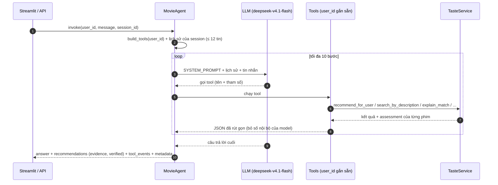
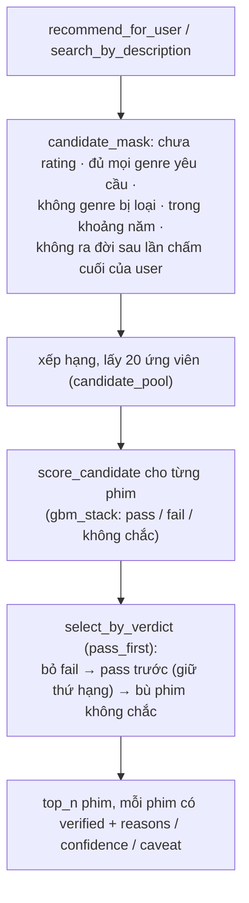

# `trusted_ai` — agent gợi ý phim

Agent hội thoại gợi ý phim trên MovieLens (610 user, 5,135 phim). Agent không tự nhớ gì về phim: mọi con số và
mọi phim đều đến từ tool, tool gọi module gu người dùng (`trusted_ai/taste/`, xem [taste/README.md](taste/README.md)).

| file | vai trò |
|---|---|
| `agent.py` | `MovieAgent.invoke`: dựng tool cho đúng user, chạy agent LangChain với `SYSTEM_PROMPT`, trả `AgentResponse` |
| `tools/factory.py` | 7 tool (gắn sẵn `user_id`), rút gọn evidence, chuyển kết quả thành `Recommendation` cho UI, ghi `tool_events` |
| `config.py` | `AgentConfig`: model, số phim tối đa mỗi tool, giới hạn bước, số tin nhắn lịch sử |
| `schemas.py` | `AgentRequest`, `AgentResponse`, `Recommendation` (có `verified`, `evidence`), `ToolEvent` |
| `session.py` | lưu lịch sử hội thoại theo `session_id` (mặc định trong bộ nhớ; thay bằng Redis khi chạy API) |
| `taste/` | dữ liệu, tín hiệu gu, tìm kiếm, xếp hạng, `score_candidate` (model học được) |

## 1. Một lượt hội thoại



- `user_id` được gắn vào tool khi dựng (`build_tools`), nên LLM không bao giờ thấy hay tự đặt user.
- `recommendations` của response là danh sách của **lần gọi tool gợi ý cuối cùng** trong lượt đó.
- Model mặc định `openai:deepseek/deepseek-v4.1-flash`, gọi qua `OPENAI_BASE_URL` / `OPENAI_API_KEY` trong `.env`.

## 2. Tool

| tool | khi nào dùng | gọi | trả về |
|---|---|---|---|
| `recommend_for_user` | gợi ý mở ("tối nay xem gì") | `TasteService.recommend_for_user` | phim xếp hạng theo CF + content + genre, đã lọc bằng verdict |
| `search_by_description` | người dùng mô tả phim muốn xem | `TasteService.search_by_description` | phim khớp mô tả (0.6·query + 0.4·gu), đã lọc bằng verdict |
| `get_peer_opinion` | "người giống tôi nghĩ gì về X" | peer ratings + `score_candidate` | điểm của người giống gu, verdict cho phim X |
| `explain_match` | "vì sao tôi sẽ thích X" | `score_candidate` + phim đã thích gần nhất | lý do, phim tương tự đã thích |
| `get_user_profile` | gu tổng quát | profile JSON | lệch gu theo genre, genre né, blind spot, phim cao/thấp nhất |
| `get_similar_users` | ai giống tôi | ma trận similarity | top user giống gu |
| `get_blind_spots` | genre chưa khám phá | catalog vs lịch sử | genre ít / chưa xem |

Tham số ràng buộc của hai tool gợi ý: `include_genres` (phim phải có **đủ** mọi genre), `exclude_genres`, `min_year`,
`max_year` (năm phát hành, tính cả hai đầu), `top_n` (≤ `AgentConfig.max_results` = 5).

## 3. Luồng gợi ý: ứng viên → ràng buộc → xác nhận gu → lý do



- **Ràng buộc cứng** được áp *trước* khi xếp hạng (`taste/filters.py`), nên luôn đúng dù LLM có quên. Giới hạn "không
  ra đời sau lần chấm cuối" (`TasteConfig.cap_year_at_last_rating`) phản ánh dữ liệu offline: thời điểm "hiện tại" của một
  user là lần chấm cuối của họ trong train.
- **Xác nhận gu** (`TasteConfig.verdict_filter`): `pass_first` (mặc định) — phim pass lên trước, phim fail bị bỏ, phim chưa
  chắc chỉ dùng để bù và có `verified: false`; `pass_only` — chỉ phim pass (1/3 case hội thoại không còn phim nào);
  `off` — thứ hạng gốc.
- **Evidence cho người dùng** (`taste/learned/explain.py`): `reasons` là câu tiếng Anh có số liệu kiểm chứng được (phim
  tương tự bạn đã chấm, người giống gu, genre, thói quen chấm, cốt truyện…), chỉ gồm tín hiệu thật sự làm verdict đổi
  (≥ 0.05 xác suất khi tắt tín hiệu đó), mạnh nhất trước; `confidence` ("About 8 in 10 movies judged like this one were
  liked"); `caveat` khi không có tín hiệu riêng về phim. Xác suất, ngưỡng, tên model bị `_trim` bỏ khỏi payload gửi LLM,
  và prompt cấm nhắc tới chúng.

Ví dụ một dòng evidence UI hiển thị:

```
Verdict: pass. About 9 in 10 movies judged like this one were liked.
Across your whole rating history, you would likely rate it about 4.9★.
On the other hand: You rate Horror -1.1★ vs your average.
The movies you rated that are most like this one (Pulp Fiction (3★), The Usual Suspects (5★), Forrest Gump (4★))
you rated +0.3★ vs your average.
```

## 4. Cấu hình

| nơi | tham số | mặc định |
|---|---|---|
| `AgentConfig` | `model` / `max_results` / `max_agent_steps` / `history_token_limit` / `keep_recent_turns` | deepseek-v4.1-flash / 5 / 10 / 100000 / 2 |
| `TasteConfig` | `verdict_filter` / `candidate_pool` / `cap_year_at_last_rating` | `pass_first` / 20 / `True` |
| `data/score_model/` | model của `score_candidate` (`python -m scripts.train_score_model`) | thiếu → luồng rule cũ |

## 5. Đánh giá hiện tại (2026-09-29)

### 5.1 `score_candidate` (verdict cho một phim) — toàn bộ test split, 7,664 cặp

| | độ phủ | pass đúng | fail đúng | tổng |
|---|---|---|---|---|
| luồng rule cũ | 35.4% | 76.9% | 53.8% | 69.6% |
| **gbm_stack (đang dùng)** | **29.8%** | **80.7%** | **85.8%** | **81.7%** |

Xác suất hiệu chỉnh tốt (lệch ≤ 0.04 mỗi khoảng); điểm yếu: user khó tính ít được pass (17 / 88). Chi tiết:
[`evaluation/score_candidate/experiment_note.md`](../evaluation/score_candidate/experiment_note.md).

### 5.2 Agent trên `recommend_test.json` — 60 hội thoại, ràng buộc cứng + độ hợp ngữ cảnh

Agent và judge `deepseek-v4.1-flash`, luồng `pass_first` (lần chạy 2026-09-29, `evaluation/recommendation/results/summary.md`):

| | phim thoả ràng buộc | case đạt hết ràng buộc | phim hợp ngữ cảnh | case có ≥ 1 phim hợp ngữ cảnh | NDCG ngữ cảnh |
|---|---|---|---|---|---|
| trước khi sửa tool | 74.3% | 48.3% | 72.1% | 90.9% | 84.6% |
| sau khi sửa lọc genre và giới hạn năm | 98.3% | 98.3% | 68.5% | 93.9% | 83.4% |
| **agent hiện tại** | **95.9%** | **96.6%** | **78.4%** | **100.0%** | **89.3%** |

Số case có ≥ n phim đạt **cả hai** tiêu chí: ≥ 1: 58 (97%) · ≥ 2: 57 (95%) · ≥ 3: 54 (90%) · ≥ 4: 51 (85%) · ≥ 5: 41 (68%).
Ràng buộc giảm nhẹ so với dòng trước vì agent hiện tại trả 10 phim cũ cho case bất khả thi `horror_after_2010` (thay
vì 5) và một lần quên `include_genres` ở `unreliable_narrator_mystery`; semantic tăng ~10 điểm.

- Luồng xác nhận gu không làm giảm ràng buộc hay độ hợp ngữ cảnh (phát lại cùng lời gọi tool: chênh ≤ 1.3 điểm).
- Đổi agent gpt-4.1-mini → deepseek: hết case rỗng (4 → 0), semantic +15 điểm, đổi lại gọi tool gần gấp 3.
- Taste (nhãn tập test: rating ≥ 4 là thích) không đưa vào bảng: 315 phim được gợi ý, nhưng chỉ 5 phim (ở 5 / 60 case)
  là user có rating trong tập test: 4 phim được chấm 4.0 (thích), 1 phim 3.0. Số mẫu này quá nhỏ để kết luận gì; gu
  được đánh giá qua `score_candidate` ở mục 5.1.

Hạn chế đã biết:
- Case `horror_after_2010` không thể thoả (user ngừng chấm năm 1996) — agent nới ràng buộc thay vì nói "không có".
- Danh sách được chấm là kết quả của lần gọi tool cuối; deepseek đôi khi gọi `recommend_for_user` sau
  `search_by_description`, làm mất phần khớp mô tả.
- Judge LLM có sai số: deepseek chấm chặt hơn gpt-4.1-mini ~3 điểm trên cùng danh sách; mỗi lần chạy agent cũng khác nhau.
- Case `similar_to_groundhog_day_no_romance`: agent vượt giới hạn 10 bước ở cả 5 lần chạy, không có câu trả lời.
- Prompt cấm nhắc tới model, nhưng 1 / 59 câu trả lời của deepseek vẫn nói "the model" (không nêu xác suất).

## 6. Chạy

```bash
streamlit run app/streamlit_app.py                                   # chat demo
python -m scripts.run_agent_cases --verdict-filter pass_first    # agent trên 60 case (cache theo case)
python -m scripts.run_conversation_eval evaluation/recommendation/results/agent_pass_first_recs.json -k 10 \
    --output evaluation/recommendation/results/eval_pass_first.json   # judge (cache .eval_cache/)
python -m scripts.summarize_agent_eval pass_first                # bảng tổng hợp → summary.md
```

Agent và judge cần `langchain` / `langchain-openai` (`requirements.txt`) và `OPENAI_BASE_URL` / `OPENAI_API_KEY` trong `.env`.
