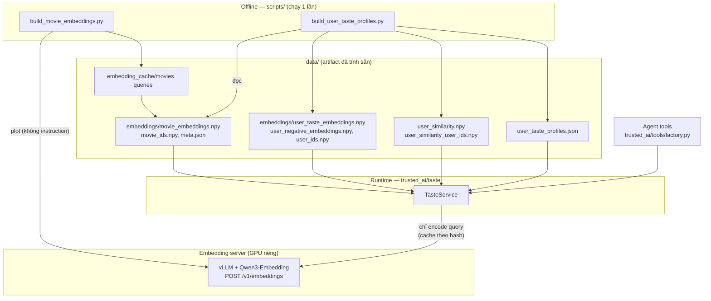
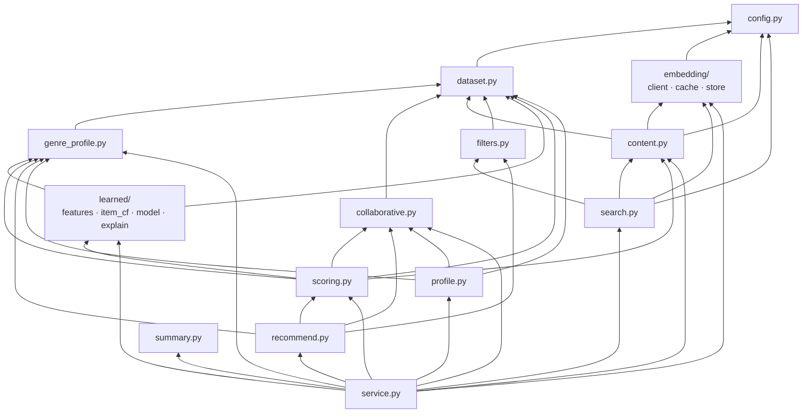
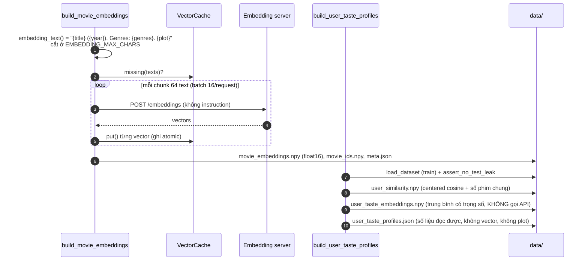
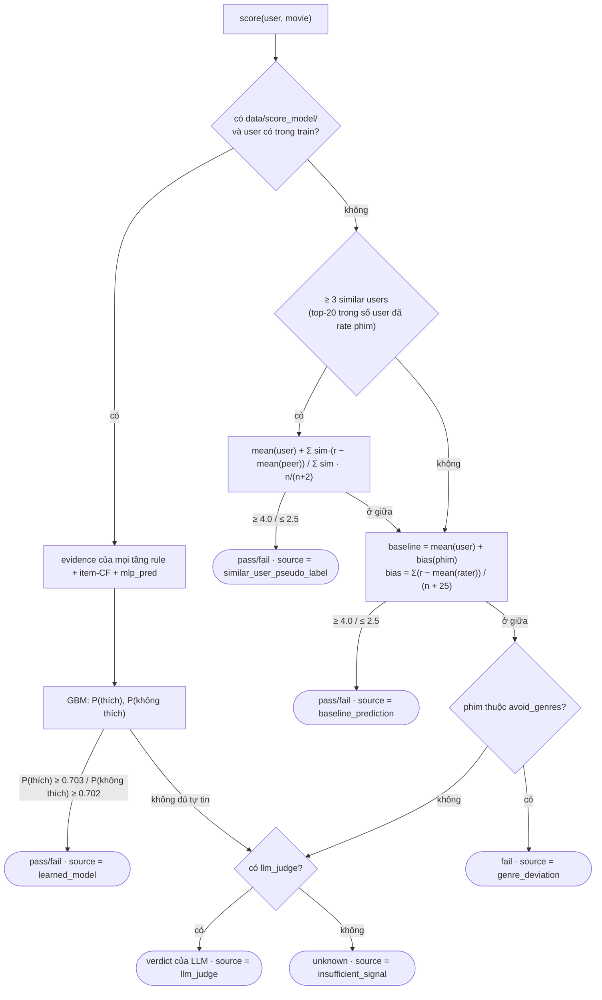
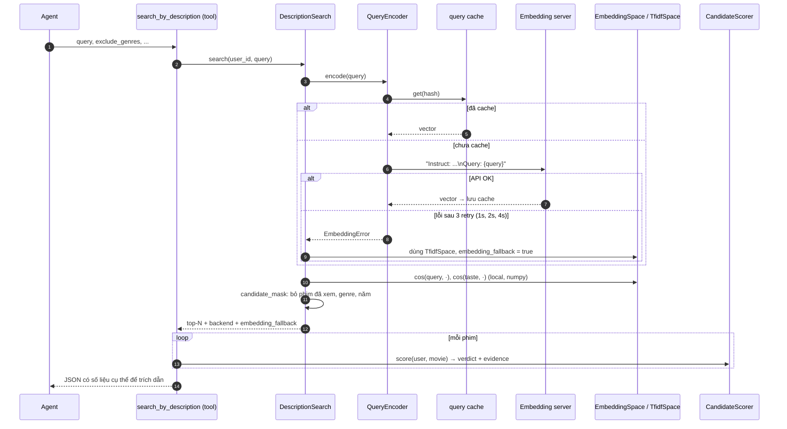

# `trusted_ai/taste` — User Taste module

Module xây "gu" của từng user từ 3 tầng tín hiệu và phục vụ các tool của agent:

| Tầng | Câu hỏi nó trả lời | File chính |
|---|---|---|
| Genre | User chấm thể loại nào cao/thấp **so với mức trung bình của chính họ**? | `genre_profile.py` |
| Collaborative | Những user nào chấm giống user này, và họ nghĩ gì về phim X? | `collaborative.py` |
| Content | Phim nào có nội dung (plot, tone, genre) giống phim user thích / giống câu mô tả? | `content.py`, `embedding/`, `search.py` |

Ba tầng được gộp ở `scoring.py` (verdict cho 1 phim) và `recommend.py` (xếp hạng nhiều phim).
`service.py` là cổng vào duy nhất mà agent (`trusted_ai/tools/factory.py`) gọi tới.

Hai nguyên tắc xuyên suốt:

1. **Chỉ dùng `ratings_train.csv`.** Không file nào trong module đọc `ratings_test.csv`,
   trừ `assert_no_test_leak` (chỉ để kiểm tra không có rò rỉ).
2. **Embedding phim tính 1 lần offline.** Lúc runtime chỉ gọi API để encode câu query của
   user; mọi cosine similarity đều tính local bằng numpy.

---

## 1. Kiến trúc tổng quan



---

## 2. Thứ tự nên đọc code

Đọc từ dưới lên (dữ liệu → tín hiệu → gộp → service). Mỗi bước chỉ phụ thuộc các bước trước.

| # | File | Đọc để hiểu | Hàm/lớp quan trọng |
|---|---|---|---|
| 1 | `config.py` | Mọi ngưỡng, trọng số, đường dẫn artifact, biến môi trường | `TasteConfig`, `TastePaths`, `EmbeddingSettings.from_env` |
| 2 | `dataset.py` | Dữ liệu vào: movies + ratings **train**, ma trận user×item | `load_dataset`, `TasteDataset`, `assert_no_test_leak` |
| 3 | `genre_profile.py` | Tầng genre: deviation, confidence, avoid, blind spot | `genre_preferences`, `avoid_genres`, `blind_spots` |
| 4 | `collaborative.py` | Tầng CF: centered cosine 610×610, top-K, dự đoán từ peer | `compute_user_similarity`, `UserSimilarity.top_k`, `predict_from_peers` |
| 5 | `embedding/client.py` | Gọi API embedding: batch, retry, normalize | `EmbeddingClient.embed_texts`, `format_query` |
| 6 | `embedding/cache.py` | Cache vector theo hash nội dung → resume khi bị ngắt | `VectorCache.get_or_embed` |
| 7 | `embedding/store.py` | Đọc/ghi `.npy` + `meta.json` | `load_movie_embeddings`, `save_user_embeddings` |
| 8 | `content.py` | Tầng content: text đưa vào model, taste vector, TF-IDF vs embedding | `embedding_text`, `taste_weights`, `ContentSpace`, `TfidfSpace`, `EmbeddingSpace` |
| 9 | `filters.py` | Ràng buộc cứng: bỏ phim đã xem, genre (phải có **đủ** mọi genre yêu cầu), năm, không phim ra sau lần chấm cuối của user | `candidate_mask` |
| 10 | `search.py` | Tìm theo mô tả + fallback TF-IDF | `DescriptionSearch.search`, `QueryEncoder` |
| 11 | `learned/` | Model học được của verdict: đặc trưng (rule + item-CF + MLP), nạp artifact, lý do dễ hiểu | `FeatureBuilder`, `ScoreModel`, `explain` |
| 12 | `scoring.py` | **Verdict 1 phim** (agent dùng để giải thích) | `CandidateScorer.score` |
| 13 | `recommend.py` | Xếp hạng nhiều phim, giải thích match, lọc ứng viên theo verdict | `recommend_for_user`, `explain_match`, `select_by_verdict` |
| 14 | `profile.py`, `summary.py` | JSON profile đọc được + câu tóm tắt gu | `build_profile`, `template_summary`, `LLMSummariser` |
| 15 | `service.py` | Nạp artifact, nối mọi thứ, API cho tool | `TasteService` |

Sau đó đọc bên ngoài module: `scripts/build_*.py`, `scripts/train_score_model.py` (pipeline offline) và
`trusted_ai/tools/factory.py` (tool nào gọi hàm nào của service).

---

## 3. Phụ thuộc giữa các file

Mũi tên `A --> B` nghĩa là A import B. Không có vòng lặp; `service.py` là file duy nhất
biết về tất cả.



---

## 4. Pipeline offline



Sau hai script trên, `python -m scripts.train_score_model` train model verdict cho `score_candidate`
(xem mục 6) và ghi `data/score_model/`: `gbm.pkl` (2 GBM), `mlp_pred.npz` (rating MLP tính sẵn cho mọi
cặp user train × phim, nên lúc chạy không cần torch) và `meta.json` (đặc trưng, ngưỡng, cấu hình). Script
này cần torch và `ratings_validation.csv`; chạy lại mỗi khi dữ liệu train/validation đổi.

Nếu script 1 bị ngắt (server chết, lỗi mạng), chạy lại chỉ encode phần còn thiếu vì cache
được ghi sau mỗi chunk. Namespace của cache chứa tên model, nên đổi model không bao giờ
dùng nhầm vector cũ.

---

## 5. Công thức cốt lõi

**Genre deviation** (`genre_profile.py`)

```
deviation(genre) = avg_rating(user, genre) − avg_rating(user)
confidence       = low (<3 rating) | medium (3–9) | high (≥10)
avoid            ⇔ deviation ≤ −0.5  và  confidence ≠ low
blind spot       ⇔ chưa rate lần nào, hoặc tỉ lệ của user < 25% tỉ lệ genre trong catalog
```

**Similar users** (`collaborative.py`)

```
r̃(u,i) = rating(u,i) − mean(u)     (ô trống = 0)
sim(u,v) = cos(r̃_u, r̃_v)
giữ v nếu: sim > 0  và  n_common_ratings ≥ 5   → lấy top-20
```

**Taste embedding** (`content.py::taste_weights`)

```
liked  = phim user chấm ≥ 4.0 (train)
w_i    = max(rating_i − mean(user), 0)          (nếu mọi w = 0 → w = 1 đều nhau)
taste  = normalize( Σ w_i · emb_i / Σ w_i )
```

**Search theo mô tả** (`search.py`)

```
score = 0.6 · cos(query, movie) + 0.4 · cos(taste, movie)  [− negative_weight · cos(neg, movie), mặc định 0]
```

**Recommend** (`recommend.py`) — mỗi tín hiệu đổi sang percentile trong phạm vi user rồi mới gộp:

```
final = 0.5 · pct(CF dự đoán) + 0.35 · pct(cos(taste, movie)) + 0.15 · pct(genre affinity)
        (user không có taste vector → bỏ số hạng content, chia lại cho tổng trọng số 0.65)
CF dự đoán = mean(user) + Σ sim·(r − mean(peer)) / Σ sim · n/(n+2)     (co về mean khi ít peer)
phim không peer nào rate → pct(CF) = 0.5 (trung tính)
```

---

## 6. `score_candidate` — verdict cho 1 phim

Agent dùng để giải thích verdict. Eval không dùng hàm này (chỉ chấm taste bằng rating test).

**Khi có `data/score_model/` và user có trong train** (mặc định), verdict đến từ model học được
*gbm_stack*: hai GBM phân loại cho P(thích = rating ≥ 4.0) và P(không thích = rating ≤ 2.5) trên 13 đặc trưng:

| nhóm | đặc trưng |
|---|---|
| rule (tính bằng chính code của các tín hiệu bên dưới) | `peer_offset`, `log_n_raters`, `user_mean`, `movie_bias`, `log_movie_n`, `user_std`, `log_user_n`, `genre_dev_mean`, `genre_dev_min`, `content_pos_minus_neg` |
| item-CF | `item_knn_offset` = trung bình (rating − mean user) của 20 phim user đã chấm giống phim này nhất theo co-rating (adjusted cosine, shrinkage n/(n+10)); `item_knn_weight` = tổng độ giống |
| MLP | `mlp_pred` = rating MLP dự đoán (embedding phim + lịch sử user), tính sẵn |

pass nếu P(thích) ≥ 0.703, fail nếu P(không thích) ≥ 0.702 (chọn out-of-fold trên validation cho
precision pass ≥ 80%, fail ≥ 70%); không đủ tự tin thì sang `llm_judge` (không chạy lại các tầng rule).

Evidence cho người dùng (`learned/explain.py`), vì người dùng không biết model là gì:
- `reasons`: câu tiếng Anh có số liệu kiểm chứng được (phim tương tự user đã chấm, người giống gu, genre,
  thói quen chấm điểm, cách người khác đánh giá phim, cốt truyện, ước lượng từ toàn bộ lịch sử). Chọn bằng cách
  lần lượt "tắt" từng nhóm tín hiệu (đặt về trung vị lúc train) trong **cùng một lô dự đoán** (~0.1 ms thêm):
  chỉ nhóm làm xác suất của verdict đổi ≥ 0.05 mới hiện, mạnh nhất trước, tối đa 4; `direction = against`
  là phản biện. Nhóm không có dữ liệu không thành lý do.
- `confidence`: mức và câu dựa trên xác suất đã hiệu chỉnh ("About 8 in 10 movies judged like this one were liked").
- `caveat`: khi không có tín hiệu riêng về phim (không peer, không phim tương tự).
- Số kỹ thuật (xác suất, ngưỡng, `mlp_pred`, mức đóng góp từng nhóm) nằm trong `evidence.model`; tool của agent
  bỏ phần này đi, và prompt dặn agent không nhắc tới model / xác suất. Các con số rule cũ vẫn giữ.



> Toàn bộ 7,664 cặp test (tổng hợp ở `evaluation/score_candidate/experiment_note.md`, mục 10–12):
> `learned_model` ra verdict cho 29.8% cặp, pass đúng 80.7%, fail đúng 85.8%, tổng 81.7%
> (luồng rule: 35.4% cặp, tổng 69.6%, nhánh `genre_deviation` chỉ đúng 31.8%). Điểm yếu: user
> khó tính (mean < 3.2) hiếm khi được pass (17 / 88 user); ngưỡng riêng theo nhóm đã thử và không giúp.
> Content chỉ vào model qua `content_pos_minus_neg`; một mình nó dự đoán *user sẽ xem* hơn là *sẽ thích*.

**Gợi ý nhiều phim dùng verdict này để xác nhận** (`TasteConfig.verdict_filter`, mặc định `pass_first`):
`recommend_for_user` / `search_by_description` xếp hạng 20 ứng viên (`candidate_pool`), chấm từng phim, bỏ phim
fail, đưa phim pass lên trước (giữ thứ tự xếp hạng), bù bằng phim chưa chắc (`verified: false`) cho đủ `top_n`.
`pass_only` chỉ trả phim pass (1/3 case không còn phim nào trên bộ test hội thoại), `off` giữ thứ hạng cũ.

**Không có model** (hoặc user không có trong train): luồng rule như sơ đồ nhánh "không" — mỗi tầng
dự đoán rating rồi so với ngưỡng chung ≥ 4.0 pass · ≤ 2.5 fail · ở giữa thì đi tiếp.

---

## 7. Runtime: một câu hỏi đi qua module thế nào

Ví dụ: *"I want a dark psychological thriller with a twist"*



---

## 8. Tool của agent → hàm của service

| Tool (`tools/factory.py`) | `TasteService` | Gọi API embedding? |
|---|---|---|
| `get_user_profile` | `get_user_profile` → đọc `user_taste_profiles.json` | Không |
| `get_similar_users` | `get_similar_users` → `UserSimilarity.top_k` | Không |
| `get_peer_opinion` | `get_peer_opinion` → fuzzy match tên + `peer_ratings` + `score` | Không |
| `search_by_description` | `search_by_description` → `DescriptionSearch.search` | **Có, 1 lần/query mới** |
| `recommend_for_user` | `recommend_for_user` → CF + content + genre | Không |
| `explain_match` | `explain_match` → `score` + phim đã thích gần nhất | Không |
| `get_blind_spots` | `get_blind_spots` | Không |

---

## 9. Chế độ suy giảm (degraded modes)

| Tình huống | Hành vi |
|---|---|
| Chưa có `data/embeddings/` | Mọi tín hiệu content dùng TF-IDF; `content_backend = "tfidf"` |
| Không đặt `EMBEDDING_BASE_URL` | Search dùng TF-IDF; content của recommend/score vẫn dùng embedding đã lưu |
| Server lỗi lúc runtime | Query mới → TF-IDF sau ~7s retry, `embedding_fallback = true`; query đã cache vẫn dùng embedding |
| `meta.json` model ≠ `EMBEDDING_MODEL` | Tắt embedding search (vector query và phim không cùng không gian) |
| Chưa có `user_similarity.npy` | Tính lại trong bộ nhớ lúc khởi động (~1s) |
| Chưa có `user_taste_profiles.json` | Profile dựng on-the-fly với `template_summary` |
| User không có trong train | `get_user_profile` trả `cold_start: true`; search chỉ dùng query; `score_candidate` dùng luồng rule |
| Chưa có `data/score_model/` | `score_candidate` dùng luồng rule (peer → baseline → genre → llm_judge) |

---

## 10. Chạy và kiểm thử

```bash
python -m scripts.build_movie_embeddings --check   # health check server
python -m scripts.build_movie_embeddings            # encode phim (resume được)
python -m scripts.build_user_taste_profiles         # similarity, taste vector, profile JSON
python -m scripts.compare_search_backends           # TF-IDF vs embedding + latency p50/p95
python -m scripts.train_score_model                 # model verdict của score_candidate (cần torch)
python -m unittest discover -s tests                # unit test (không cần server)
```

Unit test dùng dataset tổng hợp 10 phim / 6 user (`tests/test_user_taste.py`) và HTTP giả
lập (`tests/test_embedding_client.py`), nên chạy được mà không cần GPU hay server.
